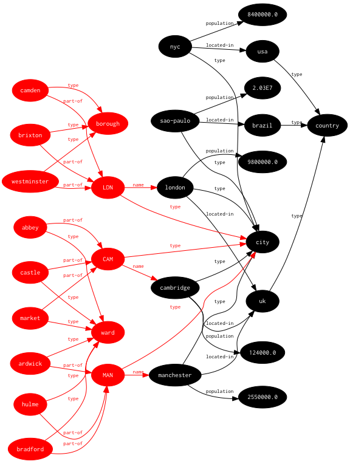

# thi.ng/trio



Simple, extensible and datatype agnostic
[triplestore](http://en.wikipedia.org/wiki/Triplestore) API and
powerful [SPARQL](http://en.wikipedia.org/wiki/SPARQL)-inspired query
engine for Clojure/ClojureScript (without any RDF specifics, but more
flexibility).

## Description & usage

- [Project overview & dependencies](src/index.org)
- [Query engine & examples](src/query.org)
- [Triplestore API & implementations](src/core.org)

## Leiningen coordinates

```clj
[thi.ng/trio "0.1.0"]
```

## License

Copyright © 2012 - 2015 Karsten Schmidt

Distributed under the [Apache Software License 2.0](http://www.apache.org/licenses/LICENSE-2.0).
