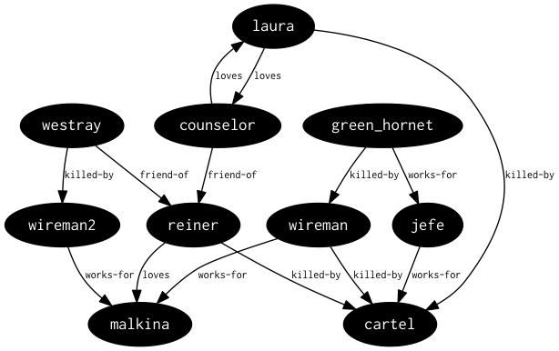

# thi.ng/trio

Simple, yet extensible and datatype agnostic
[triple store](http://en.wikipedia.org/wiki/Triplestore) API &
[SPARQL](http://en.wikipedia.org/wiki/SPARQL)-like query engine for
Clojure/ClojureScript.

## Description & usage

See [index.org](src/index.org)

## License

Copyright © 2014 Karsten Schmidt

Distributed under the [Apache Software License 2.0](http://www.apache.org/licenses/LICENSE-2.0).
